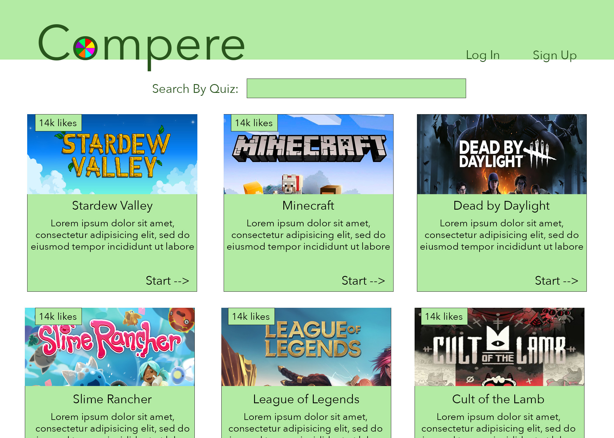
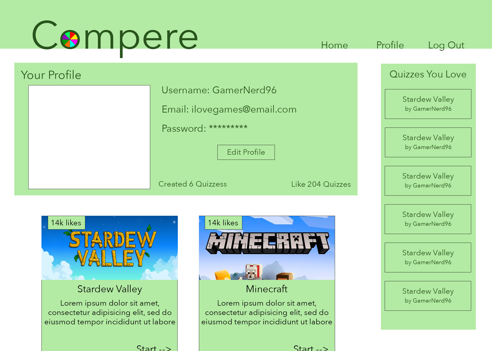
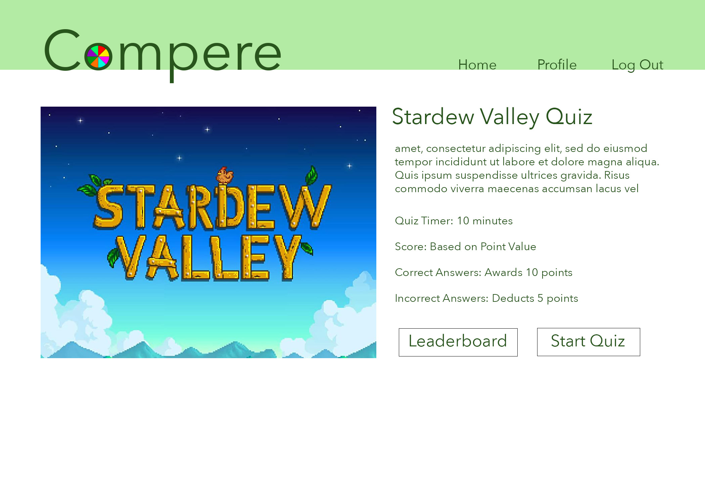

# compére

## Project Summary

We want to create a trivia will allow users to create their own quizzes to send to friends, family, or test random strangers. In order to start a quiz the user will have to create an account; after they have completed the quiz they will be redirected to a page to see if they are eligible to put their name on the leaderboard. The user may also create quizzes themselves to increase user enjoyment.

---
## Table of Contents
* [Developers](#developers)
* [MVP](#MVP)
* [Installation Instructions](#installation-instructions)
* [Database Relations](#database-relations)
* [Tech Stack](#tech-stack)
* [Stretch Goals](#stretch-goals)
* [Contact Information](#contact-information)

---

## Developers

1. Andrew Hudgins
2. Joshua Haddix
3. Mykaela Saenz

## MVP

The MVP includes a homepage the user starts on with limited functionality. When a user signs up and then is logged in, they are given full access to the website. The homepage should populate random quizzes and allow you to view the quiz details and subsequently the quiz leaderboard or take the quiz itself. After the quiz is finished, the user is sent to the leaderboards and can see their score. The homepage also allows the user to like quizzes. The dashboard should include the user's profile, a sidebar of liked quizzes, and any quizzes they have created. Quizzes should be able to be added, editted, and removed. Users should be able to be added, editted and removed. Finally, the user should be able to log out.

Mock Up Design for Landing Page / Home Page

Mock Up Design for the Profile Page

Mock Up Design for the View Quiz Page

## Installation Instructions

Before running the program, install the *npm dependencies* with:

npm i

 

To run the code, first open your mysql using: 

mysql -u root -p

 

 
and enter in your password. Then run:
  

SOURCE db/schema.sql;

 
to create and enter the database. Quit mysql and type in the command line:
  

npm run seed

  

 
to seed the data. Finally type:
  

node server.js <em>OR</em> npm start

 

 
in the command line of the root directory to launch the server. Navigate to "localhost:3001" to view the application.
  

## Database Relations

## Tech Stack

* HTML
* CSS
* JavaScipt
* Bootstrap w/ JQuery
* bcrypt-- Utilized for password hashing
* dotenv-- Utilized to connect the user's MYSQL without leaking their confidential information
* express-- Node.js framework that provides multiple features to aid in managing servers and routes
* express-handlebars-- Provides semantic framework for effectively creating templates to populate dynamic front-end GUIs
* express-session-- Utilized to create and manage server-side session middleware
* sequelize-- Eases the stresses of working with relational databases such as our MySQL
* connect-session-sequelize-- Utilized as the session store (i.e., the place where session data is being stored on the server)
* mysql2-- Used to create our MySQL database that hosts our relational data

## Stretch Goals

* Tags for quizzes for increased search parameters
* A link for user to easily deploy particular quizzes to others
* The ability to add, edit, and remove profile photos, quiz images, and question images
* Google Sign In
* Live Form Validation for analyzing user input
* Friends List

## Contact Information
Here is a link to our deployed application on [Heroku](https://vast-eyrie-87159.herokuapp.com/).

For more of our work, check out our GitHub's!
* [Andrew Hudgins](https://github.com/AHudg)
* [Mykaela Saenz](https://github.com/Mykaelas)
* [Josh Haddix](https://github.com/Spyromancy)